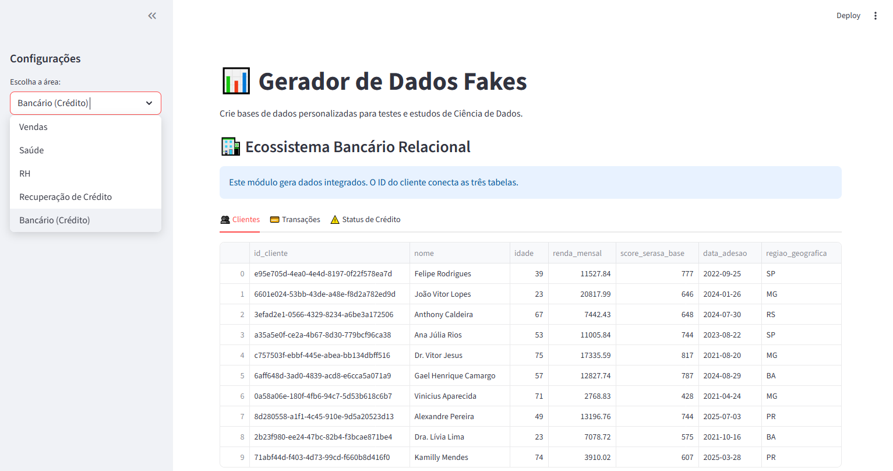

# 📊 Integrated Data Simulator: Banking & Multi-Sector

  

Este projeto é uma aplicação web interativa desenvolvida com Streamlit para a geração de ecossistemas de dados sintéticos de alta fidelidade. Diferente de geradores genéricos, esta ferramenta foca na integridade referencial e no realismo de negócio, permitindo validar sistemas complexos e treinar modelos de Machine Learning com segurança e conformidade.

## 🌟 Diferenciais Estratégicos
- **Ecossistema Bancário Relacional:** O grande destaque é o módulo de Crédito, que gera três tabelas integradas (Clientes, Transações e Status de Crédito) conectadas por UUIDs, simulando a estrutura de um Data Lake bancário real.
- **Lógica de Negócio Ética:** O gerador utiliza correlações estatísticas entre renda e score, além de parâmetros de probabilidade para inadimplência, permitindo estudos sobre Equidade (Fairness) e viés em modelos de crédito.
- **Segurança e Privacidade:** Ao criar massas de dados sintéticos localizados (pt-BR), o projeto promove a inovação tecnológica em conformidade com a LGPD, eliminando o risco do uso de dados sensíveis reais em ambientes de teste.

## ⚙️ Funcionalidades
- **Segmentação Multissetorial:** Suporte para Vendas, Saúde, RH e o avançado módulo de Risco de Crédito.
- **Interface Orientada à UX:** Organização dos dados em abas (Tabs) para facilitar a inspeção por perfis técnicos e de negócios.
- **Escalabilidade:** Controle dinâmico do volume de dados (10 a 1000 registros) com processamento otimizado via **Pandas**.
- **Exportação Pronta para Engenharia:** Download independente dos arquivos .csv com codificação UTF-8, prontos para ingestão em bancos de dados SQL ou pipelines de MLOps.

## 🛠️ Tecnologias Utilizadas
- **Core:** Python 3.x
- **Framework Web:** Streamlit.
- **Data Engineering:** Pandas & NumPy.
- **Synthetic Data:** Faker (Localização pt-BR).
- **Ambiente:** Git, Requirements.txt e prontidão para Docker.

## Estrutura do Repositório
- `app.py`: Código principal da aplicação.
- `requirements.txt`: Lista de dependências para reprodução do ambiente.

